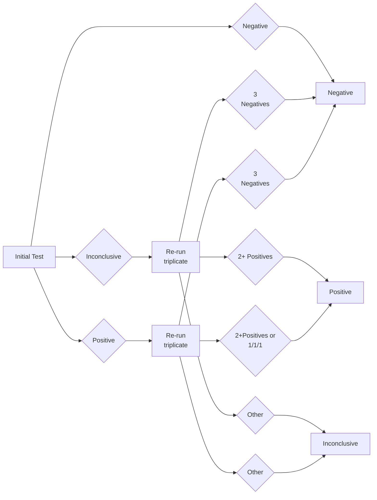

METADATA
last updated: 12-27-24 by BA fixed
primary file: Resulting Decision (Single Triplicate Re-run) Flow Chart v1.2_PUB.pdf
conversion: claude
notes:

CONTENT

Resulting decision chart (single triplicate re-run) Flow Chart v1.2

