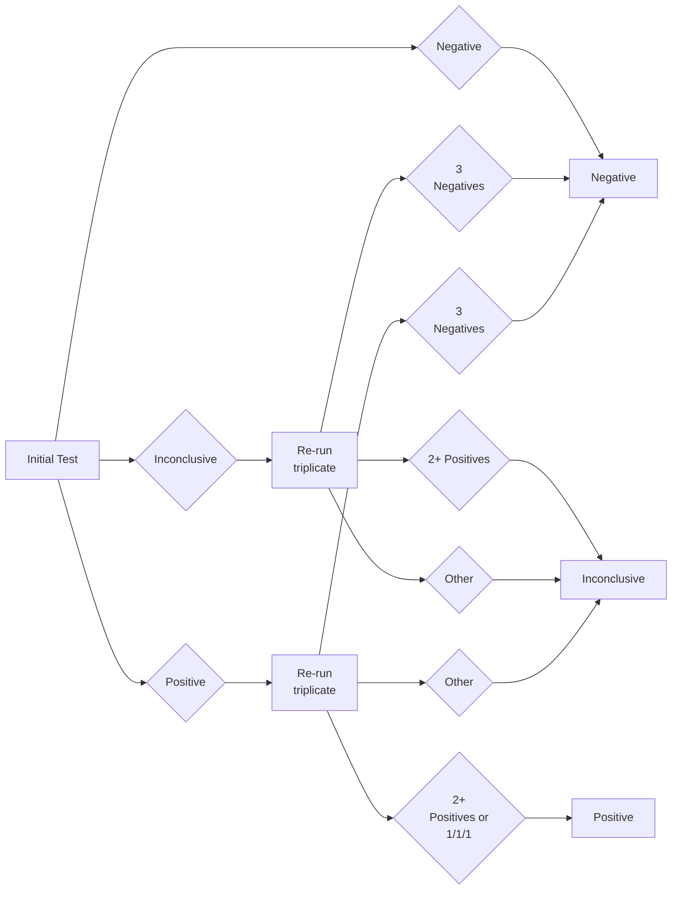

Resulting decision chart (single triplicate re-run) Flow Chart v1.2

```mermaid
flowchart LR
    Start[Initial Test] --> Neg{Negative}
    Start --> Inc{Inconclusive}
    Start --> Pos{Positive}
    
    Inc --> ReRun1[Re-run\ntriplicate]
    ReRun1 --> Pos2{2+ Positives}
    ReRun1 --> Neg3{3\nNegatives}
    ReRun1 --> Other1{Other}
    
    Pos --> ReRun2[Re-run\ntriplicate]
    ReRun2 --> PosOrOne{2+\nPositives or\n1/1/1}
    ReRun2 --> Neg4{3\nNegatives}
    ReRun2 --> Other2{Other}
    
    Neg --> NegResult[Negative]
    Neg3 --> NegResult
    Neg4 --> NegResult
    
    Pos2 --> IncResult[Inconclusive]
    Other1 --> IncResult
    Other2 --> IncResult
    
    PosOrOne --> PosResult[Positive]
```
