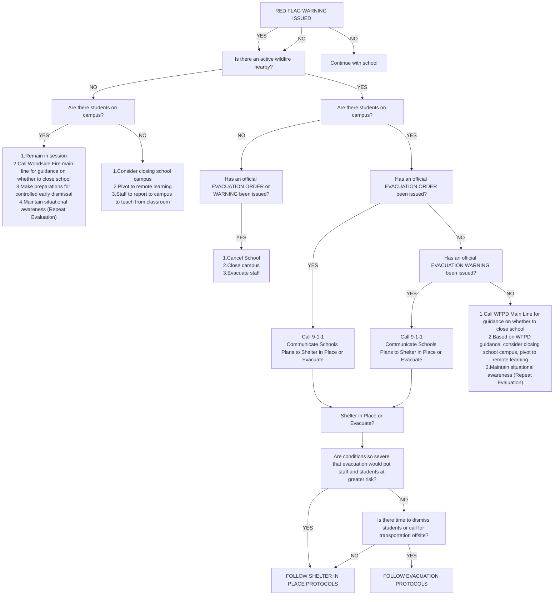

## slide 1 - Wildfire Preparedness Staff & Parent Presentation
PVSD
Woodside Fire Protection District

September 20, 2023 (Ormondale)
November 15, 2023 (virtual)

Kim Giuliacci, WFPD Fire Inspector II/ Fire Investigator/ Plans Examiner (Fire Marshal)
Selena Brown, WFPD Public Education Officer/ Emergency Preparedness Coordinator
Roberta Zarea, PVSD Superintendent

## slide 2 - Presentation Agenda
* SMCOE Big 5 Immediate Action Response Protocols (Evacuation)
* PVSD Wildfire Emergency Response Plan
* Emergency Parent Information
* Student Release Process
* Communication and Maintaining Situational Awareness
* Poor Air Quality Protocol
* Discussion

## slide 3 - Immediate Action Response: The Big 5 Protocol
[Big 5 Community Packet](https://www.smcoe.org/assets/files/For%20Schools_FIL/Safe%20and%20Supportive%20Schools_FIL/School%20Safety_FIL/The%20Big%20Five%20Community%20Packet%202023-24_1.pdf)

### CHART: Big 5 Protocol
| ACTION | DESCRIPTION |
|--------|-------------|
| SHELTER IN PLACE | Implement to isolate students and staff from the outdoor environment and provide greater protection from external airborne contaminants or wildlife. Close windows and air vents, and shut down air conditioning/heating units. |
| DROP, COVER, AND HOLD ON | Implement during an earthquake or explosion to protect building occupants from flying and falling debris. |
| SECURE CAMPUS | Initiate for a potential threat of danger in the surrounding community. All classroom/office doors are closed and locked, and all students and staff remain inside until otherwise directed. Instruction continues as planned. |
| LOCKDOWN/BARRICADE | Initiate for an immediate threat of danger to occupants of a campus or school building and when any movement will put students and staff in jeopardy. Once implemented, no one is allowed to enter or exit rooms for any reason unless directed by law enforcement. |
| EVACUATION | Implement when conditions outside the building or off-site are safer than inside or on-site. Requires moving or directing students and staff to move from school buildings to a pre-determined safe location. <- Possible Action During Wildfire|
||

## slide 4 - PVSD Wildfire Emergency Response Plan
The purpose of this plan is to provide for the orderly and coordinated evacuation of PVSD facilities once it is determined that such action is the most effective means available for protecting students and staff from the effects of an emergency situation.

* WILDFIRE EMERGENCY GUIDANCE TABLE
* WILDFIRE EMERGENCY DECISION TREE
* CAMPUS OVERVIEW AND MAPS
* SCHOOL OVERVIEW
* TRANSPORTATION OVERVIEW
* OFF SITE EMERGENCY EVACUATION PLAN
* CONTROLLED DISMISSAL & REUNIFICATION PLAN
* SHELTER-IN-PLACE PROCEDURES
* SITUATIONAL AWARENESS RESOURCES
* EMERGENCY COMMUNICATIONS PLAN
* EMERGENCY CONTACT LIST

Internal Document; Revision in Process
PVSD
SCHOOL WILDFIRE EMERGENCY RESPONSE PLAN

## slide 5 - Evacuation Terminology
In an emergency, local officials may issue either an evacuation warning
or an evacuation order.

Evacuation warning:
* Alerts people in an affected area of potential threat to life and property.
* Considers the probability that an area will be affected within a given timeframe, and prepares
people for a potential evacuation order. 
* Is particularly necessary when dealing with a variety of issues such as large school populations.

In a fast-moving fire there may not be time for first responders to issue an evacuation warning (prepare to evacuate).

Evacuation order: 
* Requires immediate movement of people out of an affected area due to an imminent threat to life.

## slide 6 - Shelter in Place (During Fast Approaching Wildfire)
Sheltering in place is an emergency-driven alternative which is seldom under the best of circumstances, but must be considered when evacuation of the site is not an option.

This may be the most appropriate protective action during a fast moving, approaching wildfire, when leaving school grounds poses more of a danger than remaining in place. 

When an evacuation may put students and staff at greater risk, it may be necessary to shelter-in-place.
 
Designated Shelter in Place locations at each school are the Multi-Use Rooms.

### SPEAKER NOTES
Under the best circumstances, sheltering‐in-place should be considered when one or more buildings on campus is designed to withstand heat and flames from an approaching wildfire. In other words, these buildings must be built with ignition-resistant construction, including well maintained defensible space, such as fire-resistant landscaping, with a minimum 100‐foot defensible space surrounding the structure(s). Woodside Fire Protection District has assisted in evaluating our defensible spaces, ignition-resistant construction, and fire mitigation efforts.

## slide 7 - Voluntary Evacuation/Unplanned Dismissal/Precautionary Closure
To best ensure the safety of staff and students, school administrators will work in conjunction with local fire and law enforcement to evaluate situations that arise relative to a school site’s unique characteristics, such as facility construction, transportation dependencies, ingress and egress options and capacity, level of defensible space around its structures, and surrounding topography. 

Depending on the circumstances, it may be best to issue an early dismissal and voluntarily evacuation.

The decision to close schools is based on many considerations, the most important of which is the safety of students, staff, parents, and others in the community. (See Decision Tree - slide 16)

## slide 8 - Transportation & Off-Site Evacuation
The District works continually with the Town of Portola Valley, the San Mateo County Department of Emergency Management (DEM), and Woodside Fire (WFPD) to explore options to set up transportation and establish off-site assembly locations in an emergency situation.

Transportation options for all students/staff are dependent upon the situation.

Off-site assembly locations are dependent on the situation.

### SPEAKER NOTES
What scenarios will district reach out to access buses, what window of time?
How will this be communicated?

Possible emergency transportation resources (buses would need to come to the schools as we don’t own buses):
* Las Lomitas Elementary School District 
* Sequoia Union High School District
* SamTrans

## slide 9 - Standard Reunification Method (SRM) Information for Parents
The SRM reunification process that will be utilized by the PVSD is:
* Notification: parents will receive a phone or text message.
“Due to XXX, the school has closed, please pick up your child at XXX location. Bring your ID.”
* Parent/guardian Expectations: 
Bring identification
Be patient

### SPEAKER NOTES
Circumstances may occur at the school which require parents to pick up their students in a formalized, controlled release. 
This process is called a Reunification and may be necessary due to weather, a power outage, hazmat, an approaching wildfire, or if any crisis situation occurs at the school. 
Because a reunification is not a typical end-of-school-day event, reunification may occur at a different location than the school a student attends. 
If this location is another school, those students may be subject to a controlled release as well.

## slide 10 - Standard Reunification Method Info for Parents
Students will only be released to individuals previously identified as a student’s emergency contact (per PowerSchool Annual Update). When a parent cannot immediately go to the reunification site, the school staff will hold students until parents (or designated individuals) can pick up their student.

For students, the school asks that students be orderly and quiet while waiting. 

Cell Phones: Keeping the cellular network usage at a minimum may be important during a reunification. Students are asked NOT to send text messages either in or out of the school or reunification area. Rarely, students may be asked to text a message to their parents or guardians

## slide 11 - SRM Student Release Process for Parents
1. Go to Reunification “Check In” area and form lines based on the first letter of student’s last name. 
2. While in line, fill out a reunification card. (This card will be provided at the time. It is perforated and will be separated during the process. Some of the same information is repeated on both the top and separated bottom of the card.) Parents are asked to complete all parts of the card. In the case of multiple students being reunified, a separate card for each student needs to be completed. 
3. During check in, picture identification will be verified. The card will be separated and the bottom half given back to the parent. 
4. Go to “Reunification” area: a runner will take the bottom half of the card and take it to the Student Assembly Area to recover the student or students.

## slide 12 - SECTION: PVSD’s Risk Reduction and Decision Tree

## slide 13 - Wildfire Risk Reduction in PVSD
The buildings at each site are generally protected from wildfire risk and are locations for shelter in place protocol:
* Ormondale and Corte Madera modernized buildings consist of fiber cement siding and fiber cement panels with gypsum sheathing, which are non-combustible. 
* Ventilation systems are equipped with screen mesh that reduce the possibility of embers entering combustible spaces. Vents can be closed remotely to prevent outside air from entering the building. The systems are also tied into the fire alarm/notification system.
* Roofing at each site are adequately rated roofing systems by the National Fire Protection Agency (NFPA) and UL (Underwriters Laboratories). 
* New buildings are fully compliant with building code Chapter 7A (formerly called the “Wildland/Urban Interface”), which is intended to govern high-fire-danger areas. Building materials are non-combustible except as noted by code 7A. The majority of visible wood is fire-resistance treated, the siding is non-combustible, the roofs are non-combustible, gutters and attic vents are protected as required, and the glass is tempered as required. The buildings were not intended to be shelters such as essential services buildings, but they are designed to resist ignition and propagation as code requires.

## slide 14 - Wildfire Risk Reduction in PVSD
Defensible space surrounds each of the campuses, and the District continues to clear unnecessary/unwanted vegetation throughout the campuses.

The District will continue to repair damaged vent screens and add screens as necessary, repair damaged siding and roofing as well as keep brush and unwanted vegetation to a minimum throughout the campuses.

The District has hired an arborist to do a risk assessment report on trees at Corte Madera and Ormondale.

## slide 15 - PVSD Wildfire Emergency Guidance Table
### CHART: WFPD Guidance for PVSD
| WILDFIRE ACTIVITY LEVEL | DESCRIPTION | PVSD ACTION | COMMUNICATION |
|------------------------|-------------|--------------|----------------|
| LEVEL 1 RED FLAG WARNING | • No active fire. • Red Flag Warning is issued. ○ Low humidity ○ High winds ○ High temperatures | • IF NO STUDENTS ON CAMPUS (Before/After School): ○ Consider Remote Learning (CDE School Closure Considerations and SMCOE Decision Making Guide for School Closure) ○ Turn away parents as they arrive. ○ Staff to remain onsite or report to school for remote learning. • IF STUDENTS ON CAMPUS (During school hours): ○ Remain in session. ○ Make preparations for controlled dismissal, if needed | • Activate parent/family communication plan (relevant protocols) • Activate staff communication plan |
| LEVEL 2 NEARBY ACTIVE WILDFIRE | A wildfire is burning in proximity to the school but there is no formal evacuation warning issued. Evacuation Warning is not yet anticipated, but an evacuation warning may be issued at a moment's notice. | • Upon guidance or direction from WFPD: • IF NO STUDENTS ON CAMPUS: ○ Remote Learning. ○ Turn away parents as they arrive. ○ Staff to remain onsite or report to school for remote learning. • IF STUDENTS ON CAMPUS: ○ Remain in session. ○ Make preparations for controlled dismissal or possible shelter in place. | • WFPD to provide guidance on status of the fire and likelihood of evacuation in the area. • District to notify parents of situation and actions to be taken. |
| LEVEL 3 EVACUATION WARNING | A formal evacuation warning is issued for the area of the District. Calls for immediate school evacuation by controlled dismissal protocols. Buses are to be ordered for any students not able to be picked up by parents. | • IF NO STUDENTS ON CAMPUS: ○ Cancel school. ○ Turn away parents as they arrive. ○ Staff to evacuate campus. • IF STUDENTS ON CAMPUS: ○ Follow controlled dismissal procedures. | • WFPD to provide guidance on status of the fire and likelihood of evacuation in the area. • District to notify parents of the situation and actions to be taken. |
| LEVEL 4 EVACUATION ORDER/ SHELTER IN PLACE | Active wildfire nearby. Alpine, Portola, and Arastradero roads blocked for limited ingress into PV to emergency vehicles only. Schools go into active shelter in place. | • IF NO STUDENTS ON CAMPUS: ○ Call 9-1-1 to communicate the status of the school. ○ Cancel school. ○ Evacuate all staff immediately. • IF STUDENTS ON CAMPUS: ○ Call 9-1-1 to communicate the status of the school. ○ Follow Wildfire Shelter in Place Protocol. ○ District to communicate to WFPD that the school is sheltering in place. | • Call 9-1-1. • District to communicate to WFPD (or Emergency Services) that the school is sheltering in place. |
||

## slide 16 - Wildfire Emergency Decision Support Tree
### DIAGRAM: Wildfire Emergency Decision Support Tree

## slide 17 - SECTION: Communication and Situational Awareness

## slide 18 - Maintaining Situational Awareness
* [San Mateo County Emergency Services (OES)](https://hsd.smcsheriff.com/divisions/homeland-security-division/area-office-emergency-services/all-hazards)
* [Ready](https://www.ready.gov/wildfires)
* [Woodside Fire Protection District](https://www.woodsidefire.org/)
* [Town of Portola Valley](https://www.portolavalley.net/for-residents/portola-valley-emergency-information)
* [San Mateo County Office of Education](https://www.smcoe.org/)
* [PulsePoint](https://www.pulsepoint.org/download/)
* [WPV-READY - BE READY TODAY](https://wpv-ready.org/)
* [SMC Alert - San Mateo County Alert System](https://www.smcgov.org/ceo/smc-alert)
* Portola Valley Radio 1680 AM - Tune to radio or stream via internet

## slide 19 - Zone Haven & SMC Alerts & Genasys
Evacuation notices are issued through [SMC Alert](https://www.smcgov.org/ceo/smc-alert)

[Genasys Protect](https://protect.genasys.com/search?z=14&latlon=37.384107%2C-122.235244): uses your location on the website and in the app to offer you the most relevant information in an emergency situation (replaces ZoneHaven). Download the app on your iphone NOW!

## slide 20 - Emergency Communications and Maintaining Situational Awareness
Internal (within District):
* Public Announcement system*
* Cell and texting
* Fire Alarm System All Call
* Two-way radios (walkie-talkies) for each classroom
* Shortwave radios
* Landline telephones
* Satellite radio adapter for cell phones and Government Emergency * Telecommunications Service (GETS)

*only if there is electrical power

External (District to parents):
* Parent Square Urgent Alert text, email, voice mail - pulls info from PowerSchool 
* PVSD website
* Social Media (Instagram, Facebook)
* PV Forum and PV NextDoor
* Town of PV Radio 1680
* SM County Office of Education website
* Portola Valley Town website
* SMC Alert
* Town of PV radio communication EPC

## slide 21 - Emergency Parent Information
* [Link](https://docs.google.com/document/d/1a-iOKnzQOsQ1ooRU0ICmg2vznlsQ2yo3ndxb0zon2Fo/edit?usp=sharing) to School Safety Plan and Parent Emergency Information (Scan QR Code for Access)
* Located on PVSD website (pvsd.net) homepage

## slide 22 - Poor Air Quality
### CHART: AQI Scale Key
| Color | Range | Description |
|--------|--------|-------------|
| GREEN | 0-50 | Good |
| YELLOW | 51-100 | Moderate |
| ORANGE | 101-150 | Unhealthy for Sensitive Groups |
| RED | 151-200 | Unhealthy |
| PURPLE | 201-300 | Very Unhealthy |
| MAROON | 301-500 | Hazardous |
||

## slide 23 - Poor Air Quality PVSD adheres to SMCOE’s Guidelines
__Poor Air Quality: PVSD adheres to [SMCOE’s Guidelines](https://www.smcoe.org/assets/files/For%20Schools_FIL/Safe%20and%20Supportive%20Schools_FIL/Air_Quality_Resources/Air_Quality_Guidance.pdf)__

1. Keep Track of Air Quality:  SMCOE and the San Mateo County Health Department use official [BAAQMD](http://www.baaqmd.gov/about-air-quality/current-air-quality/air-monitoring-data/#/aqi?id=316&view=hourly) and [AirNow](https://www.airnow.gov/state/?name=california) sites to track data and make decisions. 
2. Adjust Activity Based on Air Quality 
a. School Air Quality Activity Recommendations (see Slide 24): how PVSD addresses differing levels of air quality. 
b. Sensitive Groups: Children with certain medical conditions may be impacted by air quality in the moderate (yellow – 51-100) and unhealthy for sensitive groups (orange – 101-150) levels. Parents/guardians of these children should notify their schools. 
3. School Response: When air quality dips to unhealthy levels (red – 151-200), PVSD practices the Big Five Shelter in Place protocol (keeping all activities indoors, limiting physical activity, and minimizing the opening and closing of doors), and continue regular classroom instruction. 
a. Schools are the best place for students to be when air quality is poor as they are well supervised, can be kept indoors, and are able to continue to learn. 
b. If air quality becomes hazardous (maroon – 301-500) and schools do not have the ability to keep outdoor air from easily entering the school,then a school may decide to close. 

## slide 24 - School Air Quality Activity Recommendations
Air quality is an important consideration for schools in terms of student activities. Local air districts are available to assist schools with understanding local air quality concerns and actions they can take to protect student health. To find out more, contact your local air district.

Visit this page to learn which District serves your area:
[www.arb.ca.gov/app/dislookup/dislookup.php](https://ww2.arb.ca.gov/california-air-districts)

The following school activity recommendations are based on consultation with health researchers and several important principles drawn from recent studies. Modify these levels to correspond with the AQI, emissions concentration, or other air district recommended method for your region.

### CHART: Air Quality Level
| Activity | Level 1 | Level 2 | Level 3 | Level 4 | Level 5 |
|----------|----------|-----------|-----------|-----------|-----------|
| Recess (15min) | No restrictions | Ensure that sensitive individuals are medically managing their condition.* | Sensitive individuals should exercise indoors or avoid vigorous outdoor activities.* | Exercise indoors or avoid vigorous outdoor activities. Sensitive individuals should remain indoors.* | No outdoor activity. All activities should be moved indoors. |
| P.E. (1hr) | No restrictions | Ensure that sensitive individuals are medically managing their condition.* | Sensitive individuals should exercise indoors or avoid vigorous outdoor activities.* | Exercise indoors or limit vigorous outdoor activities to a maximum of 15 minutes. Sensitive individuals should remain indoors.* | No outdoor activity. All activities should be moved indoors. |
| Athletic Practice and Training (2-4 hours) | No restrictions | Ensure that sensitive individuals are medically managing their condition.* | Reduce vigorous exercise to 30 minutes per hour of practice time with increased rest breaks and substitutions. Ensure that sensitive individuals are medically managing their condition.* | Exercise indoors or reduce vigorous exercise to 30 minutes of practice time with increased rest breaks and substitutions. Sensitive individuals should remain indoors.* | No outdoor activity. All activities should be moved indoors. |
| Scheduled Sporting Events | No restrictions | Ensure that sensitive individuals are medically managing their condition.* | Increase rest breaks and substitutions per CIF guidelines for extreme heat.** Ensure that sensitive individuals are medically managing their condition.* | Increase rest breaks and substitutions per CIF guidelines for extreme heat.** Ensure that sensitive individuals are medically managing their condition.* | Event must be rescheduled or relocated. |
||

\* Sensitive Individuals include all those with asthma or other heart/lung conditions.

\** California Interscholastic Federation

\*** To meet the conditions for approval of a waiver due to emergency conditions (Form J-13A) from the State Superintendent of Public Instruction poor air quality must be shown to be caused by an emergency event such as a wildfire.

Information Provided by the California Department of Education

## slide 25 - Discussion Section
__Discussion__
