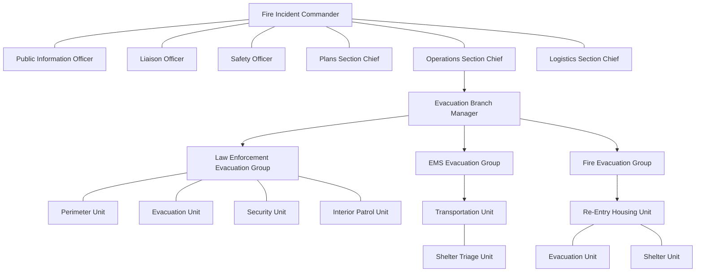

## metadata
last updated: 10-17-2024 by BA fixed tables and headers
link shared pdf: NO LINK
link shared docx: https://docs.google.com/document/d/10SAXXKqOLb1AevOmTAISQlO54HvY3C4q
pages: 57

## content

## Wildland Urban Interface Fire Evacuation Plan Town of Portola Valley V2.0 \*DRAFT\* July 2023

| REVIEWED BY: | | |
|--------------|--------------|--------------|
| Sharif Etman | Name | Name |
| Town Manager | Director | Title |
| Town of Portola Valley| Department of Emergency Services| Town of Portola Valley Emergency Preparedness Committee|
| Kimberly Giuliacci | Don Bullard | Name |
| Fire Marshal | Retired Fire Marshal | Title |
| Woodside Fire Protection District | Woodside Fire Protection District | County of San Mateo Sheriff's |
||

## APPROVAL AND IMPLEMENTATION
Town of Portola Valley
765 Portola Road
Portola Valley, CA 94028
650‐851‐1700
[www.portolavalley.net](https://www.portolavalley.net/)

Original document was provided by the Woodside Fire Protection District and has been edited by the Town of Portola Valley.

Adopted by the Portola Valley Town Council on ________

## RECORD OF CHANGES
__Portola Valley Evacuation Plan__

The Evacuation Plan, including appendices, will be reviewed, and approved on an as-needed basis. All updates and revisions to the plan will be documented.  

The goals of this revision process are: 
1. to ensure the most recent version of the plan is disseminated and implemented by emergency response personnel.
2. to track and thoroughly document all changes.  

Refer to Section IV F - Plan Changes and Maintenance below for more information.

| Description of Changes | Location of Change | Change Made By | Date of Change |
|------------------------|---------------------|-----------------|-----------------|
| | | | |
| | | | |
| | | | |
| | | | |
| | | | |
| | | | |
| | | | |
| | | | |
| | | | |
| | | | |
| | | | |
| | | | |
| | | | |
| | | | |
| | | | |
| | | | |
| | | | |
| | | | |
| | | | |
| | | | |

## TABLE OF CONTENTS
You're right, I apologize for overlooking the formatting. Here's the pipe table with appropriate bold formatting:

| __Section__ | __Page__ |
|------------------------|------|
| __APPROVAL AND IMPLEMENTATION__ | 1 |
| __RECORD OF CHANGES__ | 2 |
| __TABLE OF CONTENTS__ | 3 |
| __I. INTRODUCTION__ | 4 |
| A. Overview | 4 |
| B. Authority | 4 |
| C. Purpose | 5 |
| D. Scope | 5 |
| E. Situation | 7 |
| F. Assumptions | 7 |
| G.Associated Evacuation Plans | 7 |
| __II. CONCEPT OF OPERATIONS__ | 8 |
| A. General | 8 |
| B. Public Warning and Notification | 10 |
| 1. Protective Actions | 10 |
| 2. Protective Actions Procedures | 10 |
| 3. Notifications | 10 |
| C. Direction and Control | 10 |
| D. Organization and Assignment of Responsibilities | 12 |
| 1. Notification | 12 |
| 2. Evacuation Decisions | 13 |
| 3. Re-Entry | 15 |
| 4. Sheltering | 15 |
| E. Community Refuge Areas | 21 |
| F. Transportation Resources | 21 |
| G. Area Security | 21 |
| H. Resources | 21 |
| I. Marking of Property | 21 |
| __III. EMERGENCY CONTACT LIST__ | 23 |
| __IV. APPENDICES__ | 10 |
| __APPENDIX A – TERMS, ACRONYMS AND DEFINITIONS__ | 24 |
| __APPENDIX B – ICS__ | 28 |
| __APPENDIX C – NOTIFICATION TEMPLATES__ | 29 |
| __APPENDIX D – EVACUATION LEVELS__ | 30 |
| __APPENDIX E – JURISDICTION EVACUATION ROLES__ | 31 |
| __APPENDIX F – MAPS & EMERGENCY GATE LOCATIONS__ | 33 |
| __APPENDIX G – TEMPORARY REFUGE AREAS (TRA)__ | 48 |
| __APPENDIX H – EVACUATION DURING A WILDFIRE FOLLOWING AN EARTHQUAKE__ | 48 |
||

## I. INTRODUCTION
### A. Overview
Evacuation, the protective action of moving people and animals out of harm's way, is a critical aspect of emergency response. It is a process that seeks to preserve and protect life, reduce harm, minimize property damage, and protect the environment during potential or actual threats to a community. In planning for evacuation, the characteristics of the hazard and its magnitude, intensity, speed of onset, and anticipated duration are all significant factors. These will determine the number of people to be evacuated, the distance people must be moved to ensure their safety, the need for reception facilities, and the extent of traffic control and security required.

Thorough preparation ahead of emergency situations, coupled with effective communication throughout the evacuation process, is of utmost importance in ensuring the safety of our community. In Portola Valley, the risk of wildfires and earthquakes present the most likely catalysts for emergency evacuation. Given the geographical layout of Portola Valley with only two main ingress and egress routes - Portola and Alpine Roads - the challenges during an evacuation are amplified due to this limited access. Key establishments that require special attention, such as public schools, numerous preschools, Woodside Priory School, and the Sequoias senior living facility, are situated deep within Portola Valley. These institutions, housing some of our most vulnerable population segments, will require specialized evacuation strategies to ensure the safety and well-being of their occupants during emergency situations.

The community must be prepared to conduct both small-scale (e.g., single facility or limited local) and large-scale (e.g., extensive local and regional) evacuations at all times of the day both from known hazard areas and from unexpected incident locations.

### B. Authority
The Town of Portola Valley, Woodside Fire Protection District (WFPD), County of San Mateo Sheriff’s Office and The County of San Mateo Department of Emergency Management (DEM), shall maintain plans and annexes covering evacuation, warnings, and sheltering. This Plan works in concert to support existing frameworks and explains how these plans will be implemented during a wildland fire. 

The determination of when to initiate an evacuation order during a wildland urban Interface area fire is the responsibility of the Fire Incident Commander (FIC) who serves as the Fire Chief's designee. Law enforcement is responsible for implementing the evacuation and re-entry into the affected areas. If the situation warrants, the Town’s Director of Emergency Services (DES) or authorized designee, County of San Mateo Director of the (DEM), or authorized designee may issue a mandatory evacuation order once a local disaster declaration is put in place for their respective jurisdictions. The (WFPD), The County of San Mateo (DEM), Town’s (DES) or authorized designee, may take subsequent actions, including but not limited to, control of re-entry, curtail movement, and deny building occupancy within an affected area. The San Mateo/Santa Cruz County Community Wildfire Protection Plan (CWPP), which was adopted in 2018 and updated in 2022, calls for jurisdictions to coordinate codes and regulations across all jurisdictions within the planning area to accomplish a balance between each respective entity's mission and needed wildfire mitigation. Wildfire knows no boundaries, therefore necessitating a cross jurisdictional approach to improving wildfire evacuation outcomes is necessary through community planning.

### C. Purpose
The purpose of this plan is to direct the evacuation of any portion of the Town of Portola Valley that may be in danger from wildfire and to provide for the general welfare of persons forced to evacuate from their homes or businesses. While this Plan applies to wildland fires, many of these principles may be applied to field operations during evacuation from other hazardous incidents. During any wildfire, the need may arise to move a segment of the population from an area at risk to an area of safety.

No plan can be written so broadly as to anticipate all the circumstances that emergency response personnel may face in attempting to evacuate the population during a wildfire event. This Plan serves as a guideline. Each incident has a unique set of circumstances and challenges. The ultimate decision-making authority for evacuation operations rests with the Incident Commander which will likely include a Unified or Area Command. It is likely that multiple jurisdictional authorities will be involved with wildfire response. Therefore, it is key that the jurisdictions, elected bodies, and the County establish a policy group to ensure consistent public policy approaches as related to incident management. These guidelines are intended to provide information to facilitate decision making by the jurisdictional authority and other personnel who are supporting the evacuation/sheltering mission.

This plan provides specific guidance for a wildland urban interface fire evacuation as it relates to:
* Identification of areas most likely to be impacted by wildfire.
* Identification of limited access and egress areas.
* Identification of travel corridors and potential "pinch points".
* Identification of community refuge areas for civilians.
* Identification of temporary refuge areas for responders.
* Identification of trigger points based on potential for harm.
* Identification of individuals who need evacuation assistance.
* Identification of vulnerable locations (day care, assisted living, etc.).
* Shelter-in-place decision tree.
* Sheltering locations for evacuees.
* Public transportation assistance.
* Security of the evacuated area.
* Notification of the affected population.
* Education of public on Woodside Fire Protection District’s (WFPD) role before, during, and after evacuation.
* Evacuation Procedures
* Traffic Management
* Re-entry Protocol

This plan is a snapshot of the Town's current planning and needs to be updated and released frequently as new information is available. 

You will find more information about ICS in The Town of Portola Valley Evacuation Preparedness Guidelines.

We should go back to the good advice from Dwight D. Eisenhower, "In preparing for battle I have always found that plans are useless, but planning is indispensable". This plan needs to serve as the educational vehicle for the Town and its residents to prepare and practice for an unforeseen emergency hazard which necessitates an evacuation to take place. Our planning needs to keep up with our changing circumstances and understanding.

### D. Scope
This plan addresses evacuation issues that are specific to fires in the wildland urban interface, as defined in the San Mateo / Santa Cruz County Community Wildfire Protection Plan (CWPP). As our community continues to expand into once-rural parts of the county, more of our residents settle into what fire prevention professionals call the Wildland Urban Interface, or the WUI. As the name implies, it is where human development- houses, businesses- share a back fence with land that once was farm or ranchland. Portola Valley is expected to increase 20% in population and much of that growth will be in this interface. This evacuation plan outlines the activities and responsibilities of those agencies that will be involved in the evacuation of residents within the Portola Valley Wildland Urban Interface.

### E. Situation
* Wildland interface fires can occur anywhere the combination of vegetation and the built environment meet.
* According to our fire modeling consultants, Flame Mapper, in parts of the Town of Portola Valley, wildfires can travel over a quarter of a mile in less than fifteen minutes.
* During extreme wildfire conditions, like those experienced in the Camp Fire in 2018 and the CZU Fire in 2020, unless evacuees are already in a vehicle and ready to evacuate, they could find It challenging to escape a rapidly burning wildfire.
* A significant portion of the population and ?% of structures in Portola Valley are in the Wildland Urban Interface and could be affected by wildfire.
* Vulnerable populations may require transportation assistance during a wildfire evacuation. This group includes the elderly, mobility impaired, handicapped/disabled, those without personal transportation, those with pets and livestock, and any other individuals who have access and/or functional needs that may lead to their need for assistance.
* The size, speed, and intensity of a wildfire will determine the number of people to be evacuated, the distance people must be moved to ensure their safety, and the extent of traffic control and security required. In some cases, the utilization of Community Refuge Areas or areas evacuees can safely take shelter in, until primary evacuation shelter or location can be reached.

### F. Assumptions
* Many people will voluntarily evacuate upon being alerted to the danger of wildfire; however, there will be a lag in the decision-making process.
* Residents of neighboring areas outside the evacuation zone may spontaneously evacuate when there is concern about an impending wildfire.
* A percentage of the affected population will not evacuate whether it is the recommended protective action.
* The evacuation of large numbers of people from vulnerable areas will stress the limited capabilities of roadways available for this purpose, potentially requiring substantial time to complete an evacuation. Consequently, an evacuation must be initiated as soon as feasible upon recognition of the threat and must continue to function efficiently until completion. The need to evacuate may become evident during the day or at night and there could be little control over the evacuation start time.
* A fast-moving wildfire may block the escape routes from the affected area, preventing evacuation. Community refuge areas should be identified which will provide a safe harbor to those citizens unable to follow evacuation orders.
* Most evacuees will use personal vehicles to evacuate. Transportation may need to be facilitated for evacuees without personal vehicles or those with mobility Issues.

### G. Associated Evacuation Plans
All Special Facilities in the town (Schools, Nursing Homes, Special Needs Facilities, ranches, and businesses) need to have their own established evacuation and re-entry plans which they educate and practice with their population. The Town, WFPD, Town Emergency Preparedness Committee, and the SMC DEM, are assisting with these plans, but the responsibility for creating these separate plans and keeping them up to date is the responsibility of the individual facilities.

## II. CONCEPT OF OPERATIONS
### A. General
Evacuation is one tool to protect people from wildfires, by moving people away from the danger area. Evacuation planning must consider the characteristics of the wildfire such as its magnitude, intensity, speed, and anticipated duration. These characteristics will determine the notification timing, number of people to be evacuated, the distance people must be moved to ensure safety, evacuation areas, routes, and the need for safe refuge areas.
 
County of San Mateo and municipalities such as Portola Valley within the County may need to conduct both small-scale and large-scale evacuations at all times of the day. It is likely that simultaneous evacuations from multiple sites will be required.

This plan may be activated under any of the following conditions:
* A wildland urban interface (WUI) fire with the potential to require evacuations.
* A National Fire Danger Rating System (NFDRS) rating of High to Extreme and/or National Weather Service (NWS) Fire Weather Watch and Warning
* At the request of the jurisdictional authorities or authorized designees, including. 
field incident command. 
* Activation of any EOC in Portola Valley in support of a wildfire incident(s) 
* Request for state or federal firefighting resources

### B. Public Warning and Notification
Upon receiving notification of a possible wildfire evacuation, Fire Dispatch will inform appropriate fire service personnel of the report.
* The situation will be assessed using reports from the jurisdictional authority or their designer.
* At the recommendation of the IC (including a Unified Command), the appropriate jurisdictional authorities will authorize the activation of the Regional Notification System (RNS) or appropriate emergency public notification systems and communicate the desired messaging through the protective actions notice (See Appendix C for Sample Warning Notice via the Warning Officer), in coordination with the Joint Information Center (JIC) or through the Regional PIO group.
* Consider adding IPAWS, "High Low / Time to Go" and Genasys Protect

Warning and notifications for the public are outlined in the following sections.

#### 1. Protective Actions
* A Protective Actions Notice (See Appendix C for the Sample Protective Actions Notice) can be issued by the Incident Commander to warn people of danger or impending danger at any time.
* Under this plan, Incident Command would issue such a notice using Genasys and Integrated Public Alert and Warning (IPAWS,) in collaboration with San Mateo County DEM.
* The Incident Commander is responsible for the execution of public notifications that utilize incident resources and occur within the evacuation zone.

The following concepts apply:
* All agencies requested to assist with staffing the Evacuation Branch should be notified immediately when there is a potential evacuation (see Organization and Assignment of Responsibilities section of this plan, and the Incident Command System (ICS) in the Appendix B.)

#### 2. Protective Actions Procedures
When ordering protective actions, the following sequence should be considered:
* If protective actions are needed, the on-duty Warning Officer should immediately notify all involved agencies. (see Section D)
* Develop the protective actions notice.
* Define the area where people should shelter-in-place and the location of community refuge areas.

#### 3. Notifications
* Due to the unpredictability of wildfires, the time needed to implement specific warning procedures and/or the availability of resources, timely warning of individuals may not be possible.
* It is the responsibility of the public to monitor emergency conditions, monitor the media, and take individual protective actions. The notification should be clear as to whether evacuation is recommended or mandatory.
* Timely, notifications are greatly impacted by the amount of lead time and urgency of the event.
* The Town and its partners will utilize the following tools to share evacuation messaging:
   * IPAWS through DEM
   * Genasys Protect – available as an app and website.
   * __SMCAlert__ – the county’s emergency alert system can be set up to allow for emails, reverse 911 calls to landlines and text messages. 
   * __AM 1680__ – the Town’s radio station, which can be updated remotely. This communication means covers almost the entire Town and will be operational during power and phone line failures and in vehicles that have AM radio on route during evacuation.
   * __PVForum__ and __Next Door__
   * __Town email lists__ and news updates
   * A __high-low siren__ from Sheriff’s vehicles is the approved notice for evacuation.  Residents should make themselves aware of the sound.

### C. Direction and Control
The National Incident Command System (NIMS), using Incident Command System (ICS) principles, is used to organize the evacuation process as is consistent with federal mandates (See Appendix B). 

During a field response operation, the EOC may or may not be activated, depending on the severity and type of incident. If EOC support is requested but not yet established, the on-duty Warning Officer will fulfill EOC functions.
 
The Incident Command Post (ICP) Fire Service for a wildfire in the wildland urban interface is the location of the tactical-level, on-scene incident command and management organization. The ICP is comprised of the Incident Commander and immediate staff and other designated incident management officials. The ICP is in the vicinity of the wildfire and is where direct, on-scene control of field response units takes place. Care should be taken not to locate the ICP in a location that could be Impacted or Impeded by the wildfire.

### D. Organization and Assignment of Responsibilities
All agencies, Town/County departments, and organizations with responsibilities in this section of the plan, should develop Standard Operating Procedures that detail how the components of this plan are to be implemented at the local level (See Appendix E).
 
The following sections delineate responsibilities according to the existing evacuation processes as outlined in the Town of Portola Valley’s Emergency Operations Plans.

#### 1. Notification
a. Initial Warnings Responsibilities:
* IC – Report to WFPD Command Staff
* On-Site PIO - Social Media, On-site Media, 
* EOC- Social Media, AM Radio, Other Notifications
* DEM – IPAWS
* IC or designee – Genasys Protect
* PIO - On-site Media
* SMC Sheriffs - Door-to-Door
     
b. Fire Incident Command Responsibilities:
* Communicate information to the Town DES
* Request activation of the EOC, if needed.
* Conduct a situation assessment to determine If an evacuation is warranted and advise the SMC DEM
* Determine if "Shelter In Place, Warning, Advisory or Evacuation Orders" is appropriate.
* Identify evacuation areas and make the evacuation request to the DEM / EOC, with approval from the Incident Commander.
* Determine if voluntary evacuation is needed. If so, request notification through the Public Warning Officer.
* Establish situational awareness, assess fire severity, and determine resource needs.
* Establish an ICP and staging area as soon as possible and ensure that the location of the ICP Is disseminated to all responders.

c. Town of Portola Valley Director of Emergency Services (DES) and/or Assistant Director of Emergency Services (ADES) and/or Designee Responsibilities:
* DES of Impacted jurisdictions can Initiate a mandatory evacuation when requested by the Incident Commander.

d. Warning Officer Responsibilities:
* Responsible for the dissemination of all protective action statements and information required for the immediate preservation of human life.
* Responsible for activating warning notification systems crafting the message with IC and disseminating public warning information.
* If the EOC is activated, the notification process is completed in coordination with the Lead Public Information Officer, who will either be at the ICP or the EOC (See Section 2D regarding Notifications, and Appendix D, Evacuation Supporting Documents).
* Before an EOC activation, the Warning Officer role will be initially filled by WFPD designee, County of San Mateo Sheriff's Office designee or County of San Mateo DEM designee.
* If the Incident Commander determines the need for a protective actions statement, the Warning Officer will inform WFPD Chief Officer on call or call the 24-hour number for the SMC DEM duty officer.
* The Warning Officer should immediately coordinate with their designated Public Information Officer upon receiving any requests for public warnings from the IC.

e. Law Enforcement Responsibilities:
* Conducts evacuation of the affected area, in coordination with the Fire Department. Evacuation includes warning residents, arranging and coordinating transportation, identifying mass transportation collection points, establishing evacuation routes, and securing the evacuation zone.
* Sweeps the evacuation area to ensure that all those at risk have been advised of the potential need to evacuate.
* Develops incident-specific traffic management plans with other agencies and departments. Controls traffic and establishes alternate and evacuation routes.
* Controls access by both pedestrians and vehicles to the disaster or hazardous area, where appropriate, in coordination with the Fire Department and other jurisdictional agencies
* Documents the status of evacuation area by address.
   * Made contact and people evacuated.
   * Made contact and people refused to evacuate, and contact info collected.
   * Made contact and additional resources required to complete the evacuation.
   * No contact was made.

f. Director of Emergency Services Responsibilities:
* Emergency management, at the local government level, is established in State law, and local ordinances. Town of Portola Valley, through ordinance designates the Town Manager as being the Director or Emergency Services (DES) and is responsible for directing the emergency management program in the Town. The DES can designate an individual to coordinate that program.
* Emergency management provides the means for command, control, and communications for multiple agencies and departments that respond to an event or a crisis.
* The jurisdictional designee monitors a 24-hour number, and coordinates with the Incident Commander or WFPD designee.
* Coordinates/manages implementation of roles and responsibilities identified in this Plan.
* Coordinates/manages interagency resource ordering and coordination.
* Coordinates/manages public warning and notifications.

g. Lead PIO / PIO Responsibilities:
* Distribute emergency messages via IPAWS and Genasys
* Distribute emergency messages to the media, post to social media, and post to the Town/County website.
* Coordinate and manage media requests.
* Establish a media staging area in coordination with the IC.
* Staff the on-scene command post during the response phase, with the EOC PIO(s) In support. In such cases, the EOC PIOs will take direction from the Lead PIO at the ICP, who will take direction from the IC.
* Follow framework outlined in the Town of Portola Valley’s PIO Binder (found in the EOC) 
* Establish Joint information Center (JIC).

#### 2. Evacuation Decisions
The Incident Commander will assess the need for evacuations and plan evacuations and will coordinate support for the evacuation effort. Evacuation planning should resolve the following questions:

* What areas or facilities are at risk and should be evacuated?
* How will the public be advised of what to do?
* What travel routes should be used by evacuees?
* What transportation support is needed?
* What assistance will those with additional needs require?
* What traffic control is needed?
* Does the anticipated duration of the evacuation make it necessary to activate shelter/mass care facilities?
* How will evacuated areas be secured?
* Where do you want the evacuees to go?
* Where do you want animals to go?

a. Fire Incident Command Responsibilities:
* Identify evacuation areas on Genasys and Coordinate with DEM, EOC/DOC and the JIC/PIO.
* Utilize evacuation maps (Appendix F) to identify potential traffic control measures, evacuation routes, and personnel assignments.
* Initiate Protective Action Procedure (See Section B2 under Operations)
* Assign Public Information Officer (PIO) or JIC to coordinate media information.
* Establish an Evacuation Branch.
* Evaluate and determine whether law enforcement’s role will be as an agency representative or unified commander, depending on the scope of the incident.
* Assess and validate the need for an Evacuation Warning, Evacuation Order, and/or Shelter in Place 
   * Determine the location, potential size, and direction of Incident travel or spread.
* Unified Commanders determine potential for incident spread and request the appropriate resources to complete the evacuation and mitigate the incident concurrently.
   * Identify areas that must be immediately evacuated and label "evacuation order" areas. 
   * Identify areas that should be notified of the likelihood of evacuations within a two-hour time frame and label "evacuation warning" areas. 
* Identify traffic control points and levels of closure.
   * Determine Hard Closure, Soft Closure, or Resident Only Closure 
* Determine and disseminate evacuation routes.
* Temporary Evacuation Points (TEP) should be established if an evacuation location has not been determined.
   * Fire and law enforcement need to collaboratively work together to identify, select, and establish a safe location for a TEP. 
   * The TEP needs to be in the direction of the evacuation route and be large enough to temporarily accommodate evacuees until a shelter is established. 
   * Park-and-Rides, rest stops, or the parking lot of a government building are some examples of possible TEP’s. 
   * A representative from fire or law enforcement should be assigned to the TEP to keep evacuees informed on changes during the response. 
* Shelter Locations coordination with local EOC and/or DEM/Red Cross.
* Complete initial evacuation plan utilizing online evacuation management platform software (formerly Zonehaven). 
* Law enforcement (Agency Representative or Unified Incident Commander) will advise the appropriate dispatch center and the Department of Emergency Management (DEM) of all evacuation orders, evacuation warnings, or shelter-in-place zones.
* Law enforcement (Agency Representative or Unified Incident Commander) shall either send a mass notification messaging, using the most appropriate platform for the incident location, or request DEM to send the notification. Notification systems include:
   * Local agency mass notification system, such as Nixle
   * SMCAlert is an opt-in system with limited reach.
   * Wireless Emergency Alert (WEA) regional notification system is sent to all phones within an identified area.
* Coordinate closely with command and general staff managing the incident. 
* Fire and law will identify a PIO for the incident and make them the point of contact for the media.
* Fire and law enforcement will develop and validate information for release to the news media and public through the Incident Public Information Officer (PIO) ― If the County Emergency Operations Center (EOC) is activated, the Joint Information Center (JIC) will be staffed in support of the EOC, as needed.

__Travel Routes for Emergency Responders:__
* Routes shall be coordinated with Incident Command, Operations and Logistics. Routes for Evacuation Order areas should be determined first. 
* Consider transportation and barricade needs early, order appropriate agency.
* __Large Animal/Pet Shelters/Ag. Pass__
* Animal/pet shelter locations must be coordinated by ICP and DEM.
* Deployment of the Large Animal Evacuation Team will be requested through DEM and coordinated with the Operations Section. 

b. Town of Portola Valley Director of Emergency Services Responsibilities:
* The California Emergency Services Act and California Disaster Act, places overall responsibility for the management of local disasters with whom was appointed by the Town; that is the Director or Emergency Services. Through local ordinance, the appointee is the Town Manager.
* The Executive Order of the Governor Relating to Emergency Management provides that the DES, when a State of Local Disaster has been declared, exercise similar powers on an appropriate local scale as have been granted to the Governor in the California Emergency Services Act.
* A Disaster Declaration is also required when seeking State or Federal assistance, including a Presidential Disaster Declaration.

c. Law Enforcement Responsibilities:
* Under unified command or agency representative establish Evacuation Branch.  
* Conduct evacuations
* Establish anti-looting security patrols, when safe to do so, for evacuated areas within the perimeter.
* Assist "Group" facilities (i.e., retirement centers, schools, and daycare centers) that may need evacuation assistance.
* Dispatch Law Enforcement to Community Refuge Areas once identified by Incident Commander.
* Restrict access to evacuation areas by anyone other than responders, media, or assigned resources.
* Identify specific actions to maintain a smooth flow of traffic from evacuation routes to Community Refuge Areas, including traffic control points (See Appendix F of this plan, Traffic Management).
* Provide staffing and operational control barricade plans, including location and staffing potential for one-way/reverse-lane operations, in coordination with Town Public Works and SMC Public Works.
* Request signal light timing to increase the egress from an area only after officers are in place to direct traffic.
* Coordinate law enforcement activities with other emergency services.
* Request towing services when needed to clear disabled vehicles from evacuation routes.

d. Town EOC and SMC DEM Responsibilities:
* Coordinate evacuation operations between the affected areas and implementation of an evacuation.
* Monitor evacuation of special needs facilities, coordinate evacuation assistance, and coordinate with law enforcement and others as appropriate to facilitate transportation of special needs evacuees to alternate locations, if requested.
* Establish shelters, if needed.

e. Town and SMC Public Works Responsibilities:
* Provide traffic control devices upon request and facilitate any traffic signal light changes.
* Assist in keeping evacuation routes open.
* Provide barricades and barriers to restrict entry to evacuated areas and other areas where entry must be controlled, in coordination with law enforcement.

f. County of San Mateo Public Works and San Mateo Transit District Responsibilities:
* The respective Transportation Department and Public Works Departments are the primary agencies for the transportation functional responsibility.
* Monitors traffic flow during major events/emergencies from the Traffic Management Center.
* Responds to signal outages following disruption of services.
* Coordinate with appropriate personnel to determine the need to implement contra flow measures in areas to be evacuated.

g. County of San Mateo Animal Control (with contracts with the Peninsula Humane Society & SPCA) Responsibilities:
* Coordinate arrangements for facilities for pets arriving with evacuees, if necessary.
* Be prepared to provide supplies such as pet food, kennels, etc., if needed.

h. County of San Mateo EMS Responsibilities:
* Coordinate transportation for those who need medical care.

i. San Mateo County Transit District Responsibilities:
* Every effort should be made to encourage evacuees to leave in their own vehicles if it is safe to do so. In cases where it is not practical or where some may not have the means to do so, buses or shuttles should be used to transport evacuees.
* All transportation requests should be routed through Fire Dispatch/Communications Center.

j. Emergency GIS Response Team (GIS-ERT) Responsibilities:
* Use Geographic Information System (GIS) mapping software, as available, to map the burn to determine which homes have been destroyed or may be In the path of a wildfire.
* Help determine the best routes out of areas to be evacuated.
* Assist with repopulation mapping using incident maps, in compliance with the National Wildfire Coordinating Group.

#### 3. Re-Entry – add info on ag pass and the difference between clear to "evacuation order lifted" and "normal" status.
The process for re-entry into the evacuated areas must be coordinated to ensure the safety of the public, protection of property, and the continuation of response and 
recovery activities. After the affected areas are determined safe by the Incident 
Commander. The decision to allow re-entry into the affected/evacuated area will be made by the original issuing authority, after mitigation of hazards. For limited incidents, the Incident Commander will normally make the decision to return evacuees as is appropriate and safe in conjunction with Town DES.  For large scale evacuations, the decision of when to permit residents to return to the affected area will be made cooperatively between the Town EOC, WFPD, DEM, and municipalities in the impacted areas.
 
(Prior to formal authorization of re-entry, residents with a bona-fide emergency, as determined by the Incident Commander, may be escorted back to their residence, if it is safe to do so. Requests to enter the restricted area should be made through the Liaison Officer and approved by the Operations Chief.) 

Informing Evacuees of Re-Entry Procedures - Public Information Officers at the Incident Command Post, EOC and JIC will coordinate messaging regarding re-entry procedures. This will be done through multiple means, including news releases, public briefings, social media, website messaging and notifications. 

The decision to allow re-entry will be based on an overall evaluation of the situation, including the following major factors:
* Wildfire Areas - Wildfire activity is controlled and no longer a threat to the public.
* Access - Following a major event, a survey (ground or aerial) of the impacted areas should be conducted immediately to identify and prioritize the most seriously damaged areas of the locality. This can determine the level of damage to major routes into the area and help to determine the time needed for debris clearance from those routes.
* Essential Emergency Services- Emergency services agencies that have been moved to a safe haven prior to an evacuation need to return to their service areas.
* Public Health – Health hazard advisory has been lifted and declaration has been stated that the property is clear of hazardous waste and structural ash and debris. Water and sewer services are operating, or reasonable accommodations are in place or available.
* Subsistence - Food is available or made available in the impacted area.
* Utilities - Electricity, water, telephone, propane, and natural gas services are operating, or information is available about when they will be available in the affected area or when reasonable accommodations are in place or available.
* Structures have been inspected and deemed safe for occupancy.
* Existing services can support the people already in the impacted area as well as an additional influx of people.

a. Town’s Director of Emergency Services and/or Incident Command Responsibilities:
* Determine when and what areas will be reopened.
* Will support the incident commander and EOCs recommendations on re-entry.

b. Incident Commander Responsibilities:
* Provide directions regarding evacuation re-entry based on safety and incident stabilization.

c. Law Enforcement Responsibilities:
* Determine when and what areas will be re-opened.
* Allow entry of designated responders to include police, fire, city or other designated utility workers.
* Determine if private utility workers are allowed into the area. 
* Allow residents with appropriate ID access to designated areas.
* Allow media with valid press ID, pending Incident Commander's approval.

d. Public Information Officer (PIO) Responsibilities:
* Communicate re-entry information to evacuees upon approval by the Incident Commander.
* Use the media to advise evacuees how and when they will be able to re-enter the restricted area including:
	* Entry routes; communicate re-entry information to evacuees upon approval by the incident commander.
	* Re-entry time and date.
	* The geographic area is under restriction.
	* List of restrictions.
	* Availability of utilities.
	* ID requirements.
* Coordinate with the Town Public Works or County of San Mateo Public Works, to utilize Variable Messaging Signs (VMS) and with both 2-1-1 and 3-1·1 as additional communication sources.
* Public information for returnees should address issues such as:
	* Documenting damage for insurance purposes.
	* Caution In reactivating utilities and damaged appliances.
	* Cleanup instructions.
	* Removal and disposal of debris.
	* Post-fire safety.

e. County of San Mateo Public Works and/or Town Public Works Responsibilities:
* Coordinate with the PIO regarding the use of Variable Messaging Signs (VMS) signs to direct traffic.
        
#### 4. Sheltering
The DEM are capable of rapidly initializing a flexible sheltering framework dependent on the needs of the incident. For small-scale shelter operations the EOC will coordinate with Parks and Recreation Department, to utilize city recreation centers. For large scale, or longer-term sheltering operations DEM and EOC will implement a hybrid system.

Individual agency responsibilities can be modified to match the sheltering needs and management structure of the specific incident. All coordination will be made through Area Command located at the Town EOC.

a.     Sheltering Responsibilities:
* Incident Command or their designee will make the request to initiate sheltering operations.
* Shelter requests should be directed to the DES or DEM. For short-term/small-scale sheltering needs, the Emergency Managers may coordinate with Town stakeholders to identify available facilities.
* For large scale sheltering operations, the EOC will coordinate with regional stakeholders to identify facilities.

### E. Community Refuge Areas / Temporary Refuge Areas
The fire service has pre-identified criteria for Safe Refuge Areas within the wildland urban interface that may provide a safe area for those citizens who are unable to safely evacuate the hazard area. A person should be able to survive the radiant heat and hot smoke or gas from the fire without Personal Protective Equipment (PPE).
 
Most importantly, citizens should heed the advice of public safety personnel to leave the affected area and evacuate as soon as possible. If a citizen Is unable to evacuate the area, Community Refuge Areas can be used, although there is no guarantee of safety. Safe Refuge Areas should only be used as a last resort. 

The Incident Commander or EOC Director should ensure that the locations of Safe Refuge Areas within the affected area are given to the media for presentation to the public. The public should be advised to move to the side of the Safe Refuge Area opposite the direction in which the fire is moving.
 
Examples of Community Refuge Areas include:
* Shopping centers.
* Parking lots.
* Hardened structures with Class A roofs (i.e., schools).
* Golf courses.
* Areas that have been completely burned.
* City and county parks (Irrigated landscape).
* Open spaces (short grass).
* Irrigated fields.
* Rocky/gravel areas.
* Lakes.
* The exterior of buildings may be used as a shield against the flame front.

(See Appendix G for designated locations)

Pets should be allowed at all Safe Refuge Areas if they are properly restrained (or in carrier/crates) by their owners. Large animals such as livestock may be housed at locations determined by SMCO Large Animal Rescue Group.

### F. Transportation Resources 
Authorized personnel should make the request through County of San Mateo Public Safety Communications and identify the resources needed.

Additional coordination concepts to consider include the coordination with area schools and school districts. Any required school evacuations should be coordinated with the affected school system. Normally, school buses will be used for this transportation whenever practical.

### G. Area Security
The following steps should be taken to facilitate area security.
* Immediately close the affected area to inbound traffic during the evacuation. The affected area should be closed to all except emergency vehicles.
* The Incident Commander will determine when the area is safe to re-occupy.
* Law enforcement personnel should be placed at strategic locations to prevent unauthorized entry or reentry into the evacuated area.
* Due to the dynamic nature of a wildfire, the location of checkpoints will vary. The Town Public Works and County Public Works should be contacted for barriers to temporarily block streets leading into the burn area that will not be reopened for some time.
* Law enforcement personnel should be used to staff ingress points.
* Do not allow residents (Including those who voluntarily evacuate) into the restricted area unless specific policies and procedures are established accordingly.
* County Animal Control and SMCO Large Animal Rescue Group will coordinate with appropriate personnel in the EOC to address the concerns of residents who evacuated without their pets.

### H. Resources
General emergency response resources that may be required to conduct an evacuation are listed in the Portola Valley Emergency Operations Plan, and include the following:

* Resource Identification
* Coordination with other Jurisdictions
* Resource Management
* Private Coordination
	* Special Needs Healthcare
	* Schools and Daycares
	* Business
* Donation Tracking and Volunteer Management
* Relocation Assistance

### I. Marking of Property
The Incident Commander may designate a flagging, marking system (Urban Search and Rescue Marking System), or placard system (WUI placard System), which could be used to indicate that a house or business has been checked for occupants. The Incident Commander would determine color and/or type of markings to be used. 

Markings can be used to coordinate:
* Situation or damage assessments.
* Controlled re-entry.

Firefighters can staple or tape the WUI placard on an object near the driveway, e.g., mailbox, tree etc., so that it is plainly visible from the street to other responders. (Refer to Appendix C for template and instructions how to fill out).

Law enforcement or firefighters can wrap pre- identified tape on an object near the driveway, e.g., mailbox, tree etc., so that it is plainly visible from the street to other responders.
* Different colors can be used to show that occupants are not present, or are present, but have elected not to evacuate (during a voluntary evacuation).
* If a residence or business has not been checked for occupants, no tape should be used.
* Damaged homes or businesses should be marked to indicate if the building has been checked for victims.
* Tape or other Identification methods could be used to indicate whether a property has been deemed safe to re-enter.

## III. EMERGENCY CONTACT LIST

| Agencies | Contact | Office Phone Numbers |
|----------|---------|----------------------|
| __Animal Control__ | | |
| California Division of Homeland Security & Emergency Management | State Emergency Coordination Center | (916) 845-8510 |
| California River Forecast Center | Hydrologist | (916) 979-3056 |
| California Dept. of Commerce, Community & Economic Development | Flood Insurance Program | (800) 397-3240 |
| California Dept. of Environmental Conservation | Disaster Coordinator (primary) | (916) 323-2514 |
| American Red Cross, California Office | Disaster Services | (415) 427-8000 |
| __CHP__ - California Highway Patrol | (Local or Regional Office) | (800) 835-5247 |
| California Dept. of Conservation | Main phone line | (916) 445-0732 |
| California Army National Guard | Headquarters: | (916) 854-3000 |
| California Air National Guard: | Headquarters, Camp: | (916) 854-3000 |
| County of San Mateo Department of Emergency Management | Duty Officer | Call SMC PSC |
| County Public Safety Communications | | |
| Large Animal Rescue | | |
| National Weather Service | Web | https://www.weather.gov/ |
| __FEMA__ - Federal Emergency Management Agency | Customer Service number. | (800) 621-3362 |
| __WFPD__ - Woodside Fire Protection District | Main phone line | (650) 851-1594 |
| Town of Portola Valley | Main phone line | (650) 851-1700 |
| __CAL FIRE__ - California Department of Forestry and Fire Protection | Main phone line administration | (650) 573-3846 |
| __Cal Water__ - California Water Service | Main phone line | (650) 854-5454 |
| __Caltrans__ - California Department of Transportation | Main phone line | (916) 654-5266 |
| __PG&E__ - Pacific Gas & Electric | Main phone line | (800) 468-4743 |
| County Public Works | | |
| Town Public Works | | |
| San Mateo County Transit District | | |
| West Bay Sanitary | Main phone line | (650) 321-0384 |
||

| Personal / Agency Name | Frequency/Channel | Phone Number |
|---|---|---|
| | | |
||
||

__Resources for livestock evacuation for Portola valley:__
1. County of San Mateo Large Animal EVAC
[www.smclaeg.org](https://smclaeg.org/)	smclaeg@gmail.com	650-684-0616
2. Halter Project Animal disaster preparedness + Response
[www.HalterProject.org](https://www.halterproject.org/) rescue@halterfund.org
James Spencer 

## IV. APPENDICES
Appendix A:  Terms, Acronyms and Definitions
Appendix B:  Incident Command System
Appendix C:  Notification Supporting Documents
* Sample Protective Actions Notice
* Sample Warning Notice

Appendix D:  Evacuation Supporting Documents
* Sample Emergency Notices by Evacuation Level

Appendix E:  Jurisdiction Evacuation Roles
Appendix F:  Maps and Emergency Gate Locations
Appendix G: Shelter in Place Information
Appendix H: Evacuation During a Wildfire Following an Earthquake

## APPENDIX A – TERMS, ACRONYMS & DEFINITIONS
### Acronyms and Abbreviations

|||
|-----------|:-------------------------------------------------------|
| CERT      | Community Emergency Response Team                      |
| CRA / TRA | Community Refuge Area / Temporary Refuge Area          |
| CWPP      | Community Wildfire Protection Plan                     |
| DEM       | County of San Mateo Department of Emergency Management |
| DES       | Town’s Director of Emergency Management                |
| EMC       | Emergency Management Coordinator                       |
| EOC       | Emergency Operations Center                            |
| EOP       | Emergency Operations Plan                              |
| GIS       | Geographic Information System                          |
| IC        | Incident Commander                                     |
| ICP       | Incident Command Post                                  |
| ICS       | Incident Command System                                |
| JIC       | Joint Information Center                               |
| NFDRS     | National Fire Danger Rating System                     |
| NIMS      | National Incident Management System                    |
| NRP       | National Response Plan                                 |
| PIO       | Public Information Office or Officer                   |
| PPE       | Personal Protective Equipment                          |
| REOC      | Regional Emergency Operations Center                   |
| RNS       | Regional Notification System                           |
| SIP       | Shelter-in-Place                                       |
| SMC       | County of San Mateo                                    |
| SMC ALERT | San Mateo County Primary Alert & Warning System        |
| SMCSO     | San Mateo County Sheriff’s Office / Officer            |
| SOP       | Standard Operating Procedure                           |
| UC        | Unified Command                                        |
| WFPD      | Woodside Fire Protection District                      |
| WUI       | Wildland Urban Interface                               |
||

### Definitions
|  |  |
|------|------------|
| A Re-entry point | An area within a previous evacuation zone where residents may return according to temporary entrance times which are assigned by officials to property owners who are required to abide by stipulations and requirements established by authorities. |
| Safe Refuge Area (CRA) | A temporary, safe location to shelter citizens until either a safe evacuation route is opened, the fire threat is mitigated, or evacuees return to their homes. This may be a local setting where neighborhood citizens may congregate close to their homes, such as schools, farms, parks, vineyards, shopping centers or large parking area. CRA's may be formalized for specific areas on written plans. (See Appendix F) |
| Demobilization | The process of standing down response resources in an efficient and timely manner providing considerable cost benefits. |
| Evacuation | An organized, phased, and supervised withdrawal, dispersal, or removal of civilians from dangerous or potentially dangerous areas, and their reception and care in safe areas. (The National Incident Management System, NIMS) |
| Evacuation Order | A lawful order issued by a jurisdictional authority, to leave immediately due to an immediate threat to life. The area is lawfully closed to public access. |
| Evacuation Order(s) Lifted | The formal announcement of lifting evacuations in an area currently under evacuation. |
| Evacuation Warning | Alerting and warning of persons in a defined area of the potential need to evacuate due to threat to life and/or property in response to an emergency. Those who require additional time to evacuate, and those with pets and livestock should leave now. |
| Advisory | |
| Normal | |
| Protective Action | Actions taken by emergency management officials which are designed to protect community members in the event of a wildland urban interface fire. These actions may include directing the public to evacuate, shelter In place, or seek community refuge areas. |
| Public Warning Notice | Notification of the public about the need to monitor the media about emergency conditions, special instructions, and/or the need to take protection actions due to a wildfire in the wildland urban interface. |
| Re-entry | The controlled period in which to allow specific residents to Return to or survey a previously evacuated area or property. |
| Repopulation | The return to areas deemed safe by officials where structures are intact, allowing residents and business owners to move back in for long term habitation. |
| Shelter-in-Place | Sheltering in Place is a directive to go indoors, when conditions require that you seek protection in your home, place of employment or other location if a wildfire threatens the area. Community members should be advised by local officials when shelter in place is an option. (See Appendix G for more information). |
| Special Facilities | Certain facilities which house or serve populations that cannot care for themselves during emergency situations and/or require unique support services. Such facilities include: • Schools and day care centers, where students require supervision to ensure their safety. • Retirement and Nursing homes, where patients need specialized health care personnel and equipment to maintain their health. • Private businesses with large numbers of out-of-town visitors that may not be familiar with evacuation procedures. |
| Special Needs Populations | Individuals in the community with physical, mental, or medical care needs, may require assistance before, during, and/or after a disaster or emergency after exhausting their usual resources and support network. Special needs populations may also include economically or culturally isolated populations within the community. |
| Variable Messaging Sign (VMS) | An electronic traffic sign that is often used on roadways to give travelers information about special events, traffic congestion, roadwork zones, or speed limits on a specific highway segment. They may also ask vehicles to take alternative routes, limit travel speed, warn of duration and location of incidents or just inform of the traffic conditions. |
| Visitor Population | Individuals visiting or staying in a place outside their usual place of residence. Visitor population includes workers, employees and business and leisure travelers present in the jurisdiction, whether for single day or overnight stays. |
| Warning Officer | The official responsible for activating various warning notification systems and disseminating public warning information. |
| Genasys (formerly known as Zonehaven) ([zonehaven.com](https://genasys.com/)) | A commercial software application designed to help first responders manage evacuations during an emergency. County of San Mateo has purchased Genasys and it is now in-use throughout Portola Valley by our public safety agencies to bring fire, law, emergency services and the community together before, during, and after an emergency. Please see Appendix 5 for more information. |
||

### TYPES OF INGRESS TRAFFIC ROAD RESTRICTIONS
|  |  |
|:---------------------|:-------------------------------------------------|
| Contraflow | Contraflow is when vehicles travel in the opposite direction of a lane's normal traffic flow. This occurs during an evacuation, when all traffic lanes move toward safety and away from the hazard. This may restrict all Ingress traffic. |
| Hard Closure | Closed to all traffic except Fire and Law Enforcement. |
| Ingress Traffic Road | A designated route or roadway specifically for inbound traffic. |
| Resident only Closure | Soft closure with the additional allowance of residents and local government agencies assisting with response and recovery. |
| Soft Closure | Closed to all traffic except Fire, Law Enforcement and critical incident resources (i.e., Utility, Caltrans, City/County Roads etc. or those needed to repair or restore infrastructure). |

## APPENDIX B - ICS

## APPENDIX C – NOTIFICATION TEMPLATES
__Evacuation / Protective Actions Notice__

Date:

Time:     

The       (name of agency ordering the evacuation) advises the public to immediately:

[] EVACUATE

[] SEEK SHELTER INSIDE THE BUILDING THAT YOU ARE IN

In the area of (part of the town)       due to a (type of incident)       located at (location)      

Zone number:

Due to the nature of the incident, you shall act:

[] Immediately

[] Within       hours

__Sample Warning Notice__

The Fire Department advises the public to heed the following evacuation direction and act immediately to ensure life safety.

Nature of Evacuation:
* Voluntary []
* Mandatory []

Protective Actions:
* Evacuate via safest route leading away from the wildfire.
* If unable to leave the area, move to the nearest Safe Refuge Area; like a church or large parking __area.__
* Shelter in place only as a last resort for survival.

<u>Evacuation FAQ:</u>

* Persons in the evacuation __area__ should use their own transportation to immediately leave the area.
* If unable to reach evacuation route or if route is compromised, seek shelter in a Safe Refuge Area such as a large, paved area, irrigated open space such as ball fields (provide location or criteria)
* As a last resort Shelter in Place, unless structures are burning or highly vulnerable to ignition. Stay Inside, close all windows and doors and shut off all ventilation.
* Persons who are trapped or cannot leave the area should call 9-1-1 immediately to request emergency transportation.
* You will be out of the area for an extended period. Take critical items such as eyeglasses, prescription drugs, special medical equipment, and pets, but do not delay for possessions.
* Do NOT re-enter the evacuation __area,__ doing so puts you and responders at risk.
* Persons needing shelter should report to (shelter name and location as Identified in Evacuation Preplan map)

Evacuation Zone \#:
Subdivision Name:
Closest Shelter:
Closest SRA:

## APPENDIX E – JURISDICTION EVACUATION ROLES

## APPENDIX F – MAPS AND EMERGENCY GATE LOCATIONS
The neighborhood within the Wildland Urban Interface have been modeled to determine:
* Evacuation Complexity
* Primary and Secondary evacuation routes
* An explanation of the traffic modeling information.
* Locations requiring traffic control personnel or devices to direct evacuation traffic and to restrict re-entry into the evacuation zone.
* Maps have been created showing the evacuation routes and traffic control points, and every effort has been made to make these maps Intuitive and user-friendly.
* These maps break down each neighborhood located within the Wildland Urban Interface and show traffic evacuation routes, control points, safety locations, and optimal use of two-way or all one-way traffic.
* The maps will be available through PDF, online and the Emergency Operations Center.

### EMERGENCY GATE LOCATIONS

|  |  |  |  |  |  |  |
|:----|:----------------------|:----|:--|:------|:-------------------------|:----|
| __Gate__ | __Location with Town Padlock__ | __Type__ |  | __Gate__ | __Location with Town Padlock__ | __Type__ |
| __1__ | Russell Avenue at Hayfields Road - 3 gates | Gate |  | __8__ | Alpine Road(end of) to Nath | Gate |
| __2__ | Hidden Valley Lane at Possum Lane | Bollard |  | __9__ | Nathorst west (end of) to Alpine road | Gate |
| __3__ | Iroquois Trail (end of) to Georgia Lane | Bollard |  | __10__ | Creek Park Drive (end of) to Alpine road | Gate |
| __4__ | Sausal Drive (end of) to Cherokee Way | Gate |  | __11__ | Campo Road (end of) to Prado Court (end of) | Chain |
| __5__ | Georgia Lane at Grove Drive - 2 gates | Gate |  | __12__ | Los Trancos Rd to Buck Meadows Dr. | Gate |
| __6__ | Escobar Drive (end of) to Nathhorst east (end of) | Gate |  | __13__ | Buck Meadow Dr to Old Spanish Trail | Chain |
| __7__ | Los Trancos Rd to Buck Meadows Dr. | Gate |  |  |  |  |
||

### EVACUATION ROUTES
Due to unforeseen circumstances or hazards, it may be necessary to alter traffic control points or routes of egress. All residents should be prepared to use an alternate route or retreat to a shelter in place location. No evacuation route in the chaos of a fire or other hazard can be guaranteed to be open. Residents are encouraged to evacuate as early as possible during a warning to avoid blockages during an order

The complete Portola Valley Wildfire Traffic Evacuation Capacity Study done in 2022 can be found at [<u>www.portolavalley.net/home/showdocument?id=16378&t=63794445</u>](https://www.portolavalley.net/home/showdocument?id=16378&t=63794445).

## APPENDIX G – COMMUNITY REFUGE AREA / TEMPORARY REFUGE AREA
The refuge areas outlined on the following pages are possible locations that require careful consideration when making the determination to send residents to these locations. It is highly recommended that residents be advised to completely evacuate the Fire District.

(Note: The Fire District recommends creating agreements with larger refuge areas completely outside of the Fire District’s boundary lines such as San Mateo Expo Center, Stanford Campus, Community Centers in Menlo Park and Palo Alto)

#### Canada College

#### Horse Park at Woodside

#### Town Center and Town Center Tennis Courts

#### Corte Madera School and Frog Pond

## APPENDIX H – SEISMIC HAZARDS
Evacuation of Portola Valley During a Wildfire Following an Earthquake

***The next strong earthquake that strikes Portola Valley will create many road blockages.***

***Multiple fires could ignite due to the severe shaking. The major roads must be immediately cleared of obstructions after the earthquake for people to evacuate.***

The question facing the Town of Portola Valley is when—not if—a damaging earthquake will strike Portola Valley. A powerful earthquake (magnitude 6 or greater) will almost certainly block roads and start fires. Water, communications, and energy systems may be heavily damaged, hampering shelter-in-place directives. A large fire developing after an earthquake (WFE—wildfire following earthquake) will severely hinder evacuation of the Town. All the evacuation routes could be impacted by offset roadbeds, broken pavement, and other blockages, impeding both egress and ingress. If not quickly repaired, road blockages could be catastrophic. As an example, the photograph below, taken shortly after the magnitude 7.9 (M7.9) 1906 earthquake, shows ground displacement that rendered upper Alpine Road impassable to vehicle traffic. We expect similar road damage from the next large earthquake on the San Andreas fault system.

Powerful earthquakes trigger numerous secondary hazards in addition to wildfires. Besides creating direct surface ruptures, earthquakes produce strong shaking that can cause trees and/or power poles to fall across roadways and can damage bridges and culverts. Intense seismic shaking also causes liquefaction of saturated ground, off-fault surface displacements, landslides, and/or mudslides. Major earthquakes may also trigger surface displacements on smaller faults.

On the following pages, the map and its explanation of symbols show locations where earthquake hazards may disrupt Portola Valley’s main evacuation routes. These essential arteries may be locally blocked, slowing or prohibiting rapid evacuation during a WFE event. Immediate repair of major roadways will be essential to our survival. It is difficult to predict exactly where blockages will occur after a particular earthquake and unlikely that all potential blockages shown on the map will occur during one event. In Portola Valley, many seismically active faults are well mapped and precisely located, whereas features for a range of other breaks are less well documented and/or are poorly located. The map employs red lines for faults: heavy solid lines indicate well-documented breaks, whereas long and short dashes mark progressively less well-proven faults. Moreover, because Portola Valley is broadly covered by vegetation and surficial layers of unconsolidated alluvium and soil, which obscure evidence of old surface ruptures, many hidden faults may well exist but are yet to be discovered and mapped.

See Evacuation of Portola Valley During a Wildfire Following Earthquake \[LINK\] for a fuller

discussion.

Portola Valley Geologic Safety Committee

\[date\]
