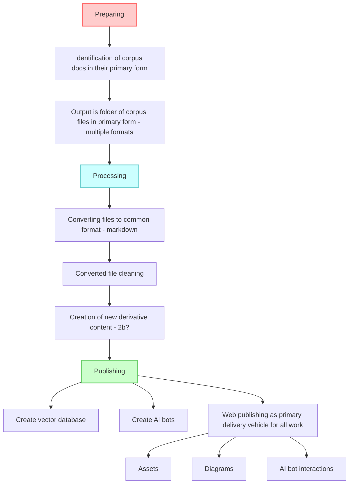
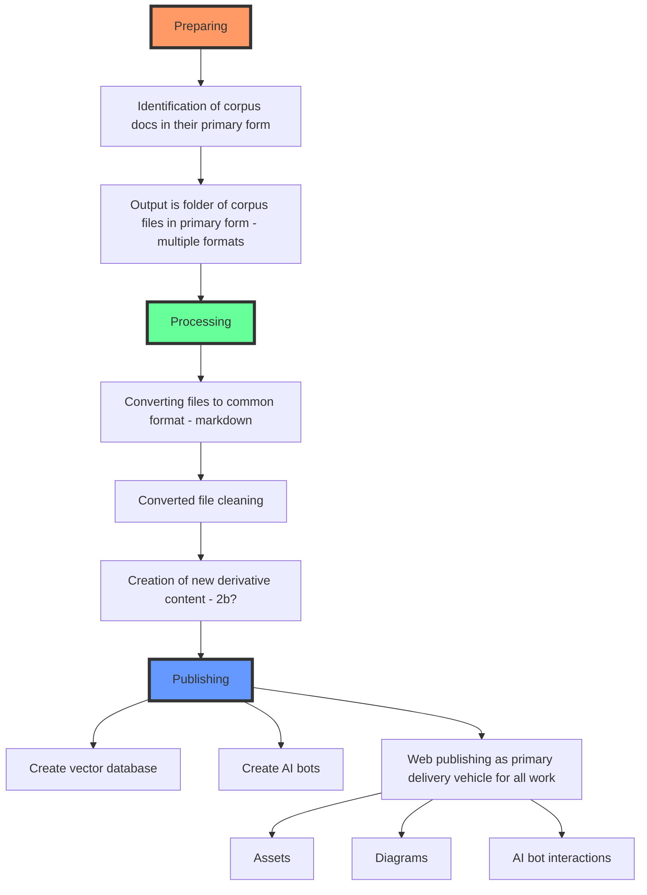

Created in Notion (mermaid + Notion AI)

```mermaid
graph TD
    A[Preparing]:::highlight1 --> B[Identification of corpus docs in their primary form]
    B --> C[Output is folder of corpus files in primary form - multiple formats]
    C --> D[Processing]:::highlight2
    D --> E[Converting files to common format - markdown]
    E --> F[Converted file cleaning]
    F --> G[Creation of new derivative content - 2b?]
    G --> H[Publishing]:::highlight3
    H --> I[Create vector database]
    H --> J[Create AI bots]
    H --> K[Web publishing as primary delivery vehicle for all work]
    K --> L[Assets]
    K --> M[Diagrams]
    K --> N[AI bot interactions]

    classDef highlight1 fill:#ffcccc,stroke:#ff6666,stroke-width:2px;
    classDef highlight2 fill:#ccffff,stroke:#66cccc,stroke-width:2px;
    classDef highlight3 fill:#ccffcc,stroke:#66cc66,stroke-width:2px;


```

Created with Whimsical GPT

```mermaid
graph TD
  A[Preparing] --> B[Identification of corpus docs in their primary form]
  B --> C[Output is folder of corpus files in primary form - multiple formats]
  C --> D[Processing]
  D --> E[Converting files to common format - markdown]
  E --> F[Converted file cleaning]
  F --> G[Creation of new derivative content - 2b?]
  G --> H[Publishing]
  H --> I[Create vector database]
  H --> J[Create AI bots]
  H --> K[Web publishing as primary delivery vehicle for all work]
  K --> L[Assets]
  K --> M[Diagrams]
  K --> N[AI bot interactions]
  style A fill:#f96,stroke:#333,stroke-width:4px
  style D fill:#6f9,stroke:#333,stroke-width:4px
  style H fill:#69f,stroke:#333,stroke-width:4px
```